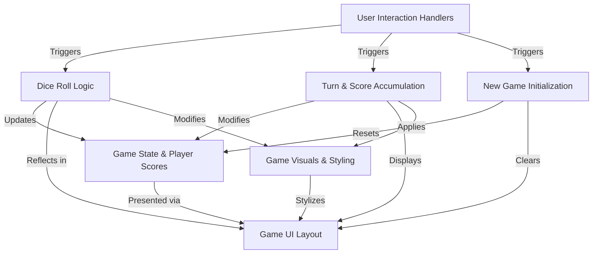

# Tutorial: pig_game

This project implements the **Pig Game**, a *two-player dice game* where players roll a die to accumulate points. The main goal is to be the first to reach a *winning score* (10 in this version). Players can continually roll to increase their *current turn score*, but rolling a '1' results in losing all points for that turn and switching players. Alternatively, a player can *hold* their current points, adding them to their *total score* before their turn ends. The game also allows players to *reset and start a new game* at any time.

## Visual Overview

## Chapters

1. [Game UI Layout
](01_game_ui_layout_.md)
2. [User Interaction Handlers
](02_user_interaction_handlers_.md)
3. [Game State & Player Scores
](03_game_state___player_scores_.md)
4. [Dice Roll Logic
](04_dice_roll_logic_.md)
5. [Turn & Score Accumulation
](05_turn___score_accumulation_.md)
6. [New Game Initialization
](06_new_game_initialization_.md)
7. [Game Visuals & Styling
](07_game_visuals___styling_.md)

---

Generated by [AI Codebase Knowledge Builder](https://github.com/The-Pocket/Tutorial-Codebase-Knowledge).
